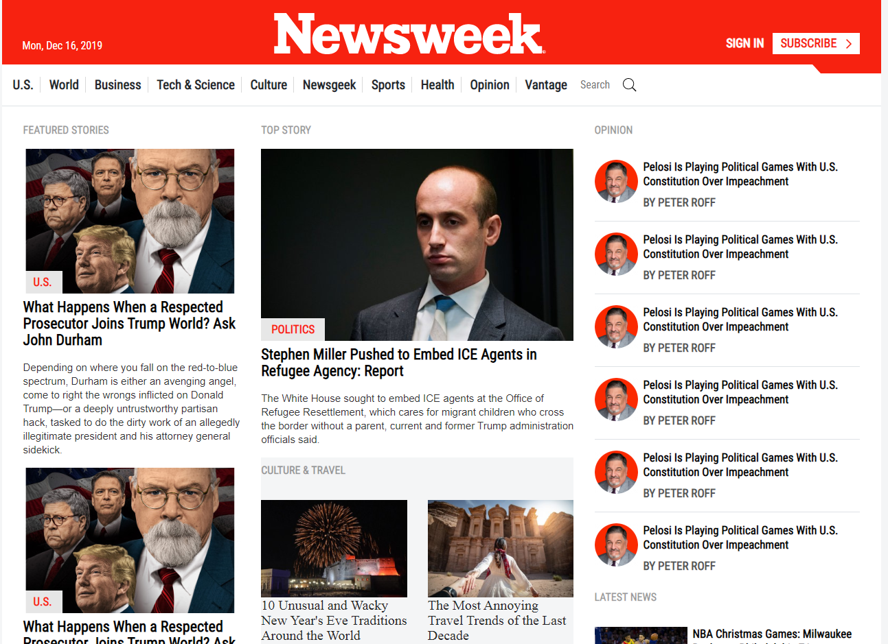
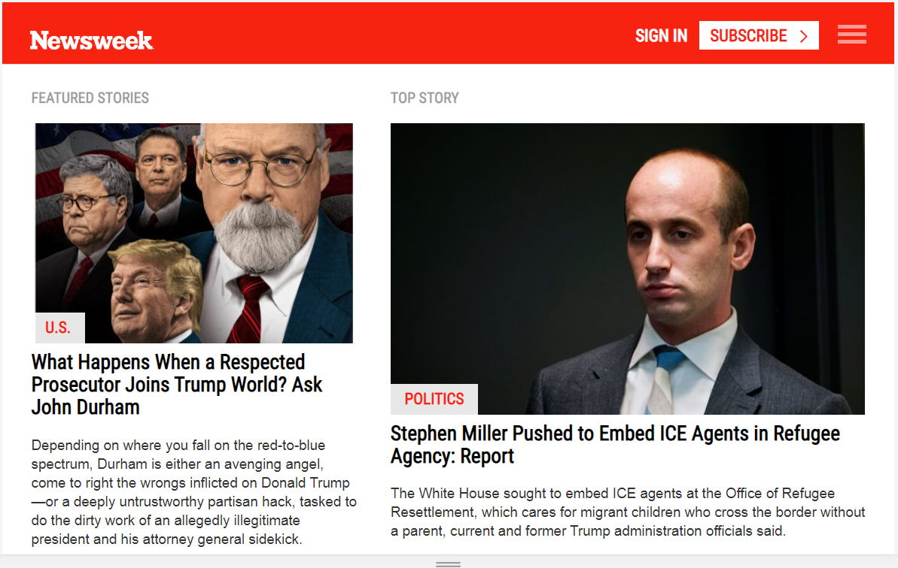
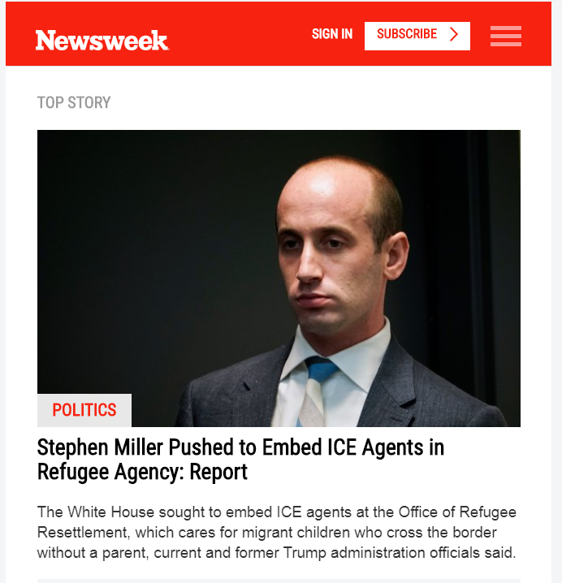

# Newsweek clone

> A clone of the [Newsweek](https://www.newsweek.com/) page.

### 1330px 

    

### 960px

    

### 760px

    

This project consisted of building the [Newsweek](https://www.newsweek.com/) webpage using Twitter’s Bootstrap framework, the world’s most popular framework for building responsive, mobile-first sites. 

## Built With

- HTML
- CSS
- Bootstrap

## Live Demo

[https://fivan18.github.io/newsweek-bootstrap/]( https://fivan18.github.io/newsweek-bootstrap/)

## Getting Started

**Download this project and use your favorite web brower to open the index.html to see how it looks like.**

## Authors

👤 **Ivan Ulises Guzman Sanchez**

- Github: [@fivan18](https://github.com/fivan18)
- Twitter: [@fivanunam](https://twitter.com/fivanunam)
- Linkedin: [fivan](www.linkedin.com/in/fivan)

## 🤝 Contributing

Contributions, issues and feature requests are welcome!

Feel free to check the [issues page](https://github.com/fivan18/newsweek-bootstrap/issues).

